## **Настройка кластера Kraft**
1. сгенерировал CLUSTER ID:

- C:\kafka\bin\windows>kafka-storage.bat random-uuid

2. оформатировал папку логов:
- C:\kafka\bin\windows>kafka-storage.bat format -t EHZqUBx0TZW8Rs5wxjj-nQ -c C:/kafka/config/kraft/server.properties
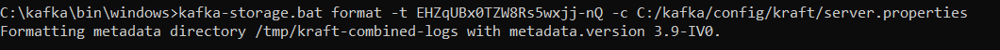
3. запустил кафку c одной нодой:

- C:\kafka\bin\windows>kafka-server-start.bat C:/kafka/config/kraft/server.properties
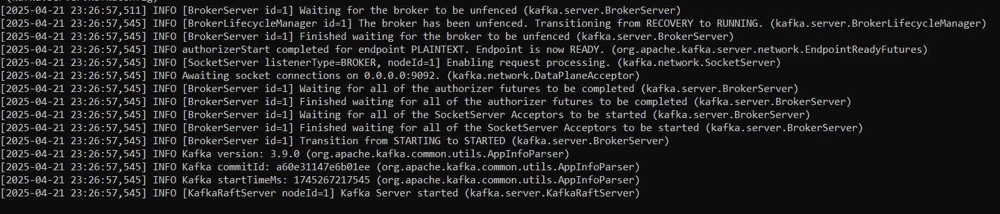
4. проверил работу кластера Kraft:

- C:\kafka\bin\windows>kafka-cluster.bat cluster-id --bootstrap-server localhost:9092,localhost:9093
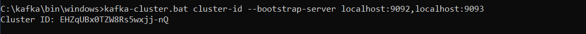
5. погасил брокера

- C:\kafka\bin\windows>kafka-server-stop.bat --bootstrap-server localhost:9092,localhost:9093

## **Настройка SASL/PLAIN для kafka**
6. Настройка запуска сервера находится в файле configs/server-sasl.properties. Суперпользователь kafka называется kafka.
Также создал 3 пользователя - obiwan, luke, r2d2
7. запустил брокер с настройками sasl

- C:\kafka\bin\windows>kafka-server-start.bat C:/kafka/config/kraft/server-sasl.properties
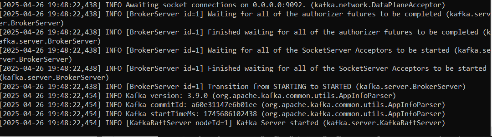
8. попытался прочитать сообщение из топика test без настройки пользователя

- C:\kafka\bin\windows>kafka-console-producer.bat --bootstrap-server localhost:9092 --topic test --from-beginning
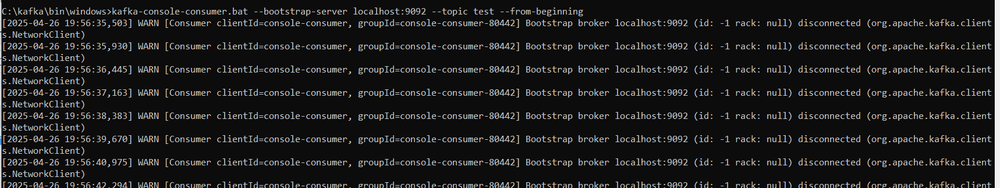
9. прочитал топик test с настройкой пользователя kafka

- kafka-console-consumer.bat --bootstrap-server localhost:9092 --topic test --from-beginning --consumer.config C:/kafka/config/kraft/users/kafka_SASL.properties
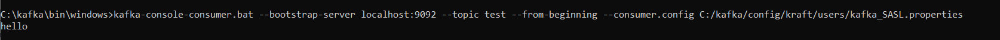
## **Настройка авторизаций пользователей**
10. создал топик force с помощью пользователя kafka

- C:\kafka\bin\windows>kafka-topics.bat --create --topic force --bootstrap-server localhost:9092 --command-config C:/kafka/config/kraft/users/kafka_SASL.properties
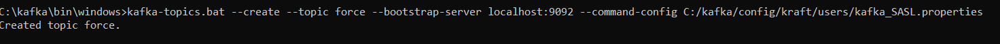
11. Установил следующие права для топика force:
- Пользователь obiwan - запись
- пользователь luke - чтение
- пользователь r2d2 - без прав

- C:\kafka\bin\windows>kafka-acls.bat --bootstrap-server localhost:9092 --add --allow-principal User:obiwan --operation Write --topic force --command-config C:/kafka/config/kraft/users/kafka_SASL.properties
  
- C:\kafka\bin\windows>kafka-acls.bat --bootstrap-server localhost:9092 --add --allow-principal User:luke --operation Read --topic force --command-config C:/kafka/config/kraft/users/kafka_SASL.properties
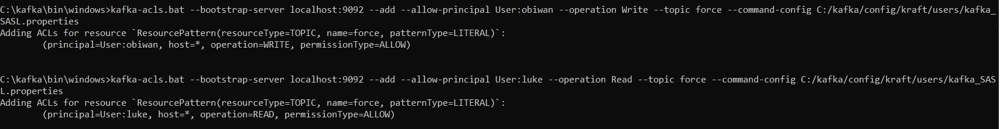
12. настроил авторизацию пользователей для группы jedi для чтения топика force

- C:\kafka\bin\windows>kafka-acls.bat --bootstrap-server localhost:9092 --add --allow-principal User:obiwan --operation Read --group jedi --command-config C:/kafka/config/kraft/users/kafka_SASL.properties

- C:\kafka\bin\windows>kafka-acls.bat --bootstrap-server localhost:9092 --add --allow-principal User:luke --operation Read --group jedi --command-config C:/kafka/config/kraft/users/kafka_SASL.properties

- C:\kafka\bin\windows>kafka-acls.bat --bootstrap-server localhost:9092 --add --allow-principal User:r2d2 --operation Read --group jedi --command-config C:/kafka/config/kraft/users/kafka_SASL.properties
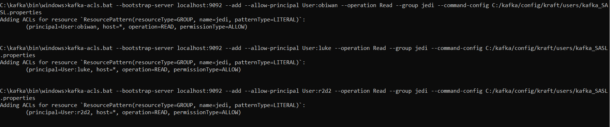

13. получил лист топиков для каждого пользователя - список тоиков доступен только пользователям с настроенной операцией Read и Write:

- C:\kafka\bin\windows>kafka-topics.bat --list --bootstrap-server localhost:9092 --command-config C:/kafka/config/kraft/users/obiwan_SASL.properties

- C:\kafka\bin\windows>kafka-topics.bat --list --bootstrap-server localhost:9092 --command-config C:/kafka/config/kraft/users/luke_SASL.properties

- C:\kafka\bin\windows>kafka-topics.bat --list --bootstrap-server localhost:9092 --command-config C:/kafka/config/kraft/users/r2d2_SASL.properties
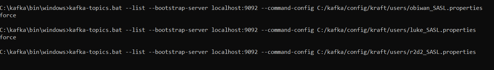
14. попробовал записать в топик force каждым пользователем, успешно только для пользователя obiwan с правом на Write

- C:\kafka\bin\windows>kafka-console-producer.bat --bootstrap-server localhost:9092 --topic force --producer.config C:/kafka/config/kraft/users/obiwan_SASL.properties

- C:\kafka\bin\windows>kafka-console-producer.bat --bootstrap-server localhost:9092 --topic force --producer.config C:/kafka/config/kraft/users/luke_SASL.properties

- C:\kafka\bin\windows>kafka-console-producer.bat --bootstrap-server localhost:9092 --topic force --producer.config C:/kafka/config/kraft/users/r2d2_SASL.properties
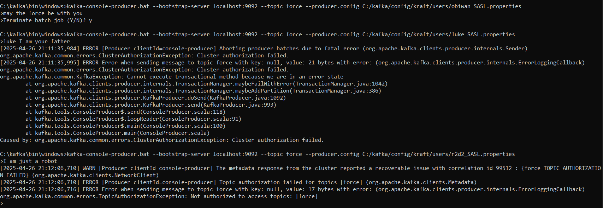
15. попробовал прочитать сообщения в топике force группой jedi для каждого пользователя - успешно только для пользователя luke с правом Read

- C:\kafka\bin\windows>kafka-console-consumer.bat --bootstrap-server localhost:9092 --topic force --group jedi --from-beginning --consumer.config C:/kafka/config/kraft/users/obiwan_SASL.properties

- C:\kafka\bin\windows>kafka-console-consumer.bat --bootstrap-server localhost:9092 --topic force --group jedi --from-beginning --consumer.config C:/kafka/config/kraft/users/luke_SASL.properties

- C:\kafka\bin\windows>kafka-console-consumer.bat --bootstrap-server localhost:9092 --topic force --group jedi --from-beginning --consumer.config C:/kafka/config/kraft/users/r2d2_SASL.properties
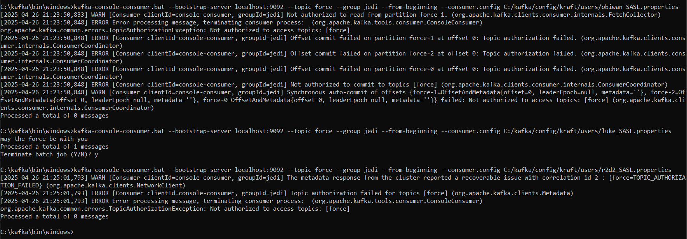
